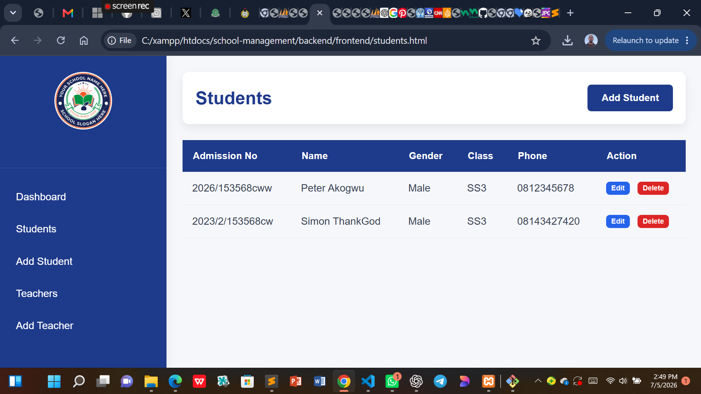
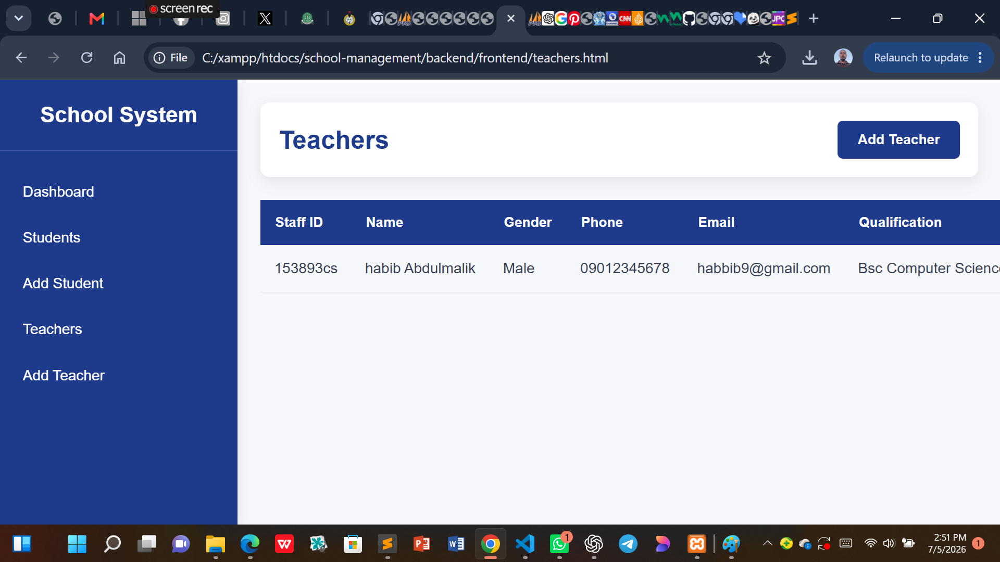

# 🎓 School Management System

A modern School Management System built using **Node.js**, **Express.js**, **MySQL**, **HTML**, **CSS**, and **JavaScript**.

---

## 🚀 Features

### Authentication

- Admin Login
- Admin Registration
- JWT Authentication
- Password Encryption (bcrypt)

### Student Management

- Add Student
- View Students
- Edit Student
- Delete Student

### Teacher Management

- Add Teacher
- View Teachers
- Edit Teacher
- Delete Teacher

### Dashboard

- Responsive Admin Dashboard
- Professional Sidebar Navigation
- Responsive Tables

### Security

- Helmet
- Rate Limiting
- Password Hashing
- JWT Authentication

---

## 🛠 Technologies Used

- Node.js
- Express.js
- MySQL
- HTML5
- CSS3
- JavaScript
- bcrypt
- JWT
- Helmet
- Express Rate Limit

---

## 📂 Project Structure

```
school-management/
│
├── backend/
├── frontend/
├── README.md
├── .gitignore
└── .env.example
```

---

## ⚙ Installation

Clone the repository:

```bash
git clone https://github.com/YOUR_USERNAME/school-management-system.git
```

Install dependencies:

```bash
npm install
```

Create a `.env` file using `.env.example`.

Start the server:

```bash
node server.js
```

---

## 📸 Screenshots

# 📸 Screenshots

## Login Page


## Register Page



## Dashboard


## Students


## Teachers


---

## 👨‍💻 Author

**OJOBO SIMON AKOR**

---

## 📜 License

This project is licensed under the MIT License.